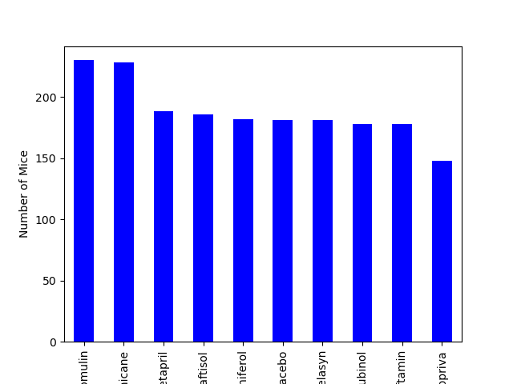
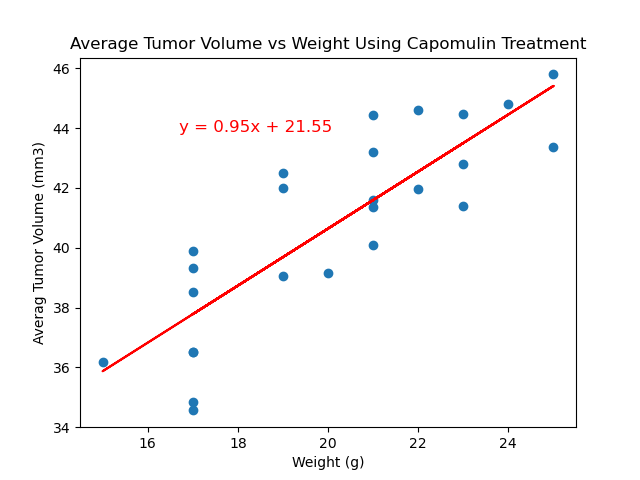
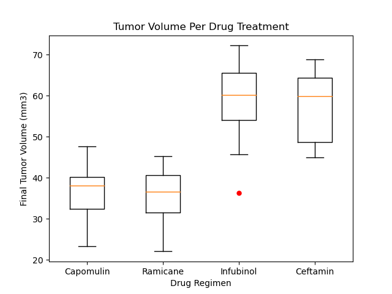

# Pymaceuticals Inc.

## Analysis

• Ramicane & Capomulin are both effective at treating(reducing) tumor volume with Ramicane showing the best results.

• Our data found correlation (0.84) in mouse weight and their average tumor volume. This translates to larger tumors for heavier mice.

• Infubinol was the only drug that showed potential outliers out of the 4 tested.

• Example of mouse s185 (3-month old female) the Capomulin showed a consistent decrease in tumor size over approxiamtely 45 days.
